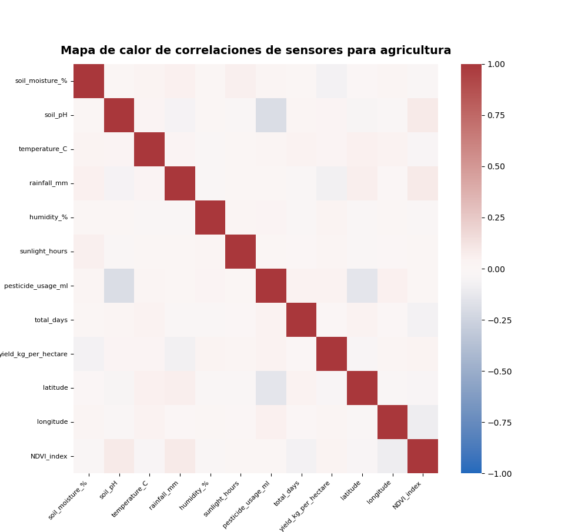

# Visualización de datos - PEC 2
## Visualización 2 - Heatmap

El conjunto de dattos sobre el cual se trabaja contiene información sobre el suelo de las granjas. Concretamente hay información sobre sensores que miden los parametros del suelo como  son la humedad o el PH. También hay información sobre la producción, técnicas y productos utilizados como fertirlizantes.

Para la realización del Heatmap se ha optado por buscar las correlaciones de las variables numéricas. De esta forma podemos ver si los sensores aportan información relevante o tienen dependencia entre ellos. Esta información será importante para posteriores análisis, ya que lo ideal es que sean lo más independientes posibles.

Lo que podemos apreciar es que por lo genera hay poca correlación. La más notable, aunque pequeña, es el uso de pesticida con el pH del suelo y la latitud. Es una relación inversa, a más pH menor cantidad de fertilizante se utiliza.

Otra relación interesante sería el indice NDVI con el pH del suelo y las precipitaciones. Esto nos indica que un alto pH y la abundancia de lluvias favorece al indice NVDI. El resto de relaciones son muy insignificantes y se podrían considerar independientes entre si.

Este análisi podría ser el paso previo a un implementación de data mining para obtener patrones de producción en base al suelo. Y es este heatmap nos permitiría saber si las variables son independientes o si tendríamos que aplicar alguna transformación o eliminación de algún campo.

Referencia a Kaggle: https://www.kaggle.com/datasets/atharvasoundankar/smart-farming-sensor-data-for-yield-prediction